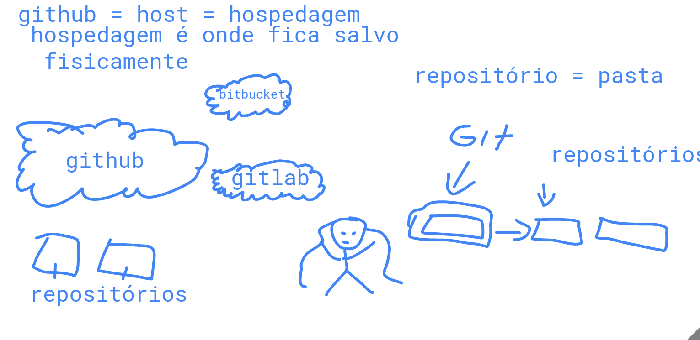

# Github



## GIT E GITHUB:

> git é um site

repositório = pasta
github = host = hospedagem
hospedagem é onde fica salvo fisicamente

quando faz qualquer alteração no código vai no '+' no ícone do git, depois vai no terminal dá um git commit -m '', e depois um git push origin master.


dúvida, achou mais legal, difícil.
prints, anotações, 

fazer um git clone, abrir no visual studio clone.
e colocar as anotações. 
salva como jpeg - imagem

> Adiciona o arquivo em stage
```bash
git add ./01-github/readme.md 
```
> Comita os arquivos em stage
```bash
git commit -m 'primeiro commit
```
> Submete os commits não enviados para o remote origin
```bash
git push origin master
```
> Puxa os commits remotos para o repositório local
```bash
git pull origin master
```
---
20/08/20